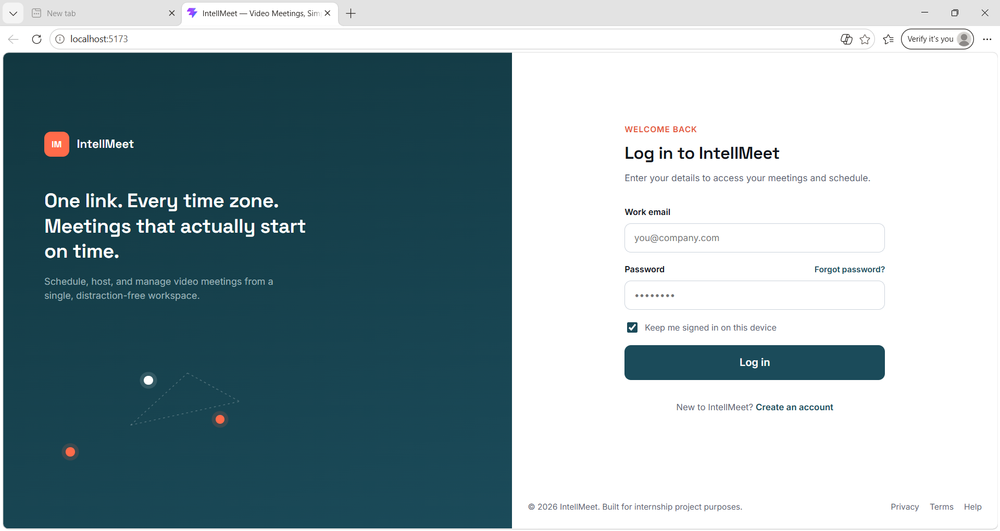
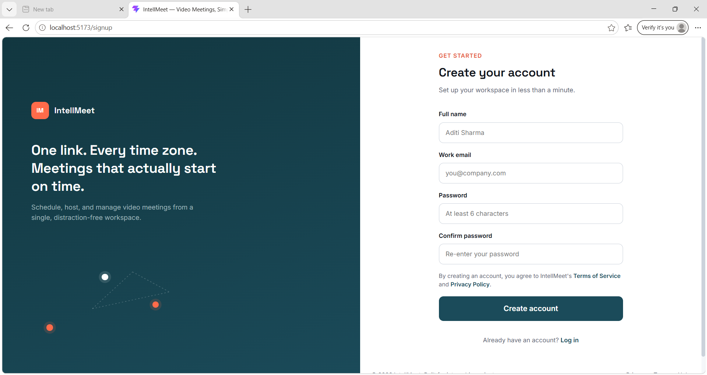
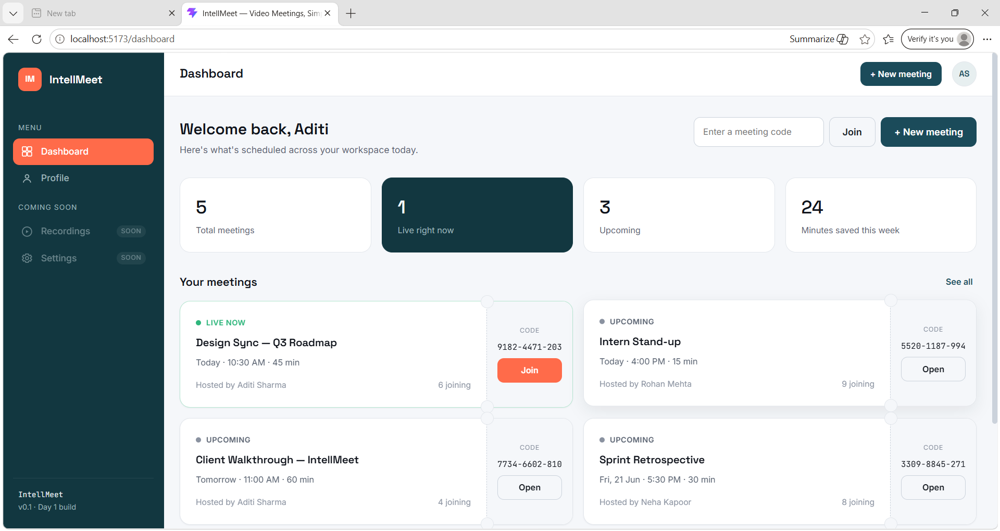
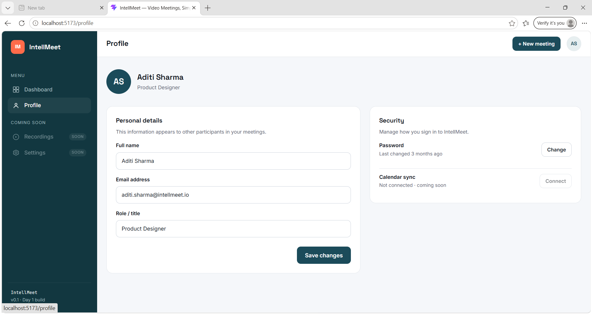
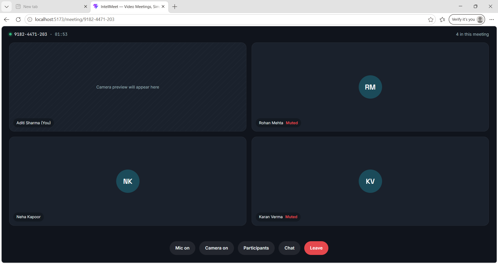

# IntellMeet

## Overview

IntellMeet is a MERN-stack based meeting management and video conferencing platform designed to facilitate online collaboration and communication. The project provides a foundation for secure user authentication, meeting creation, meeting participation, and user profile management.

## Objectives

* Provide a platform for creating and joining online meetings
* Implement secure user authentication
* Manage meeting information efficiently
* Build a scalable architecture for future real-time communication features

## Tech Stack

### Frontend

* React.js
* Vite
* React Router DOM
* CSS

### Backend

* Node.js
* Express.js

### Database

* MongoDB
* Mongoose

### Authentication

* JWT (JSON Web Tokens)
* bcrypt

### Version Control

* Git
* GitHub

## Project Structure

intellmeet/
├── frontend/
├── backend/
├── docs/
├── screenshots/
└── README.md

## Features

### User Management

* User Registration
* User Login
* User Profile Management

### Meeting Management

* Create Meetings
* Join Meetings
* Meeting Room Interface

### Security

* Password Hashing
* JWT Authentication
* Protected Routes

## Database Design

### User Schema

| Field           | Type   |
| --------------- | ------ |
| Name            | String |
| Email           | String |
| Password        | String |
| Profile Picture | String |
| Created At      | Date   |

### Meeting Schema

| Field        | Type     |
| ------------ | -------- |
| Meeting ID   | ObjectId |
| Host ID      | ObjectId |
| Meeting Name | String   |
| Participants | Array    |
| Created At   | Date     |

## Screenshots

### Login Page

### Signup Page

### Dashboard

### Profile Page

### Meeting Room

## Challenges Faced

* MongoDB Atlas connectivity issues
* Frontend and backend integration
* Team coordination and task distribution
* Time constraints during development

## Future Enhancements

* Real-time video conferencing using WebRTC
* Screen sharing
* In-meeting chat
* Meeting recording
* Advanced user roles and permissions

## Team Members

* Anjali
* Surya
* Junaid
* Sonam

## Learning Outcomes

This project helped in understanding:

* React application structure
* Routing using React Router
* MERN stack architecture
* MongoDB database design
* Authentication workflows
* Git and GitHub collaboration

## License

This project was developed as part of the Zidio Internship Program.